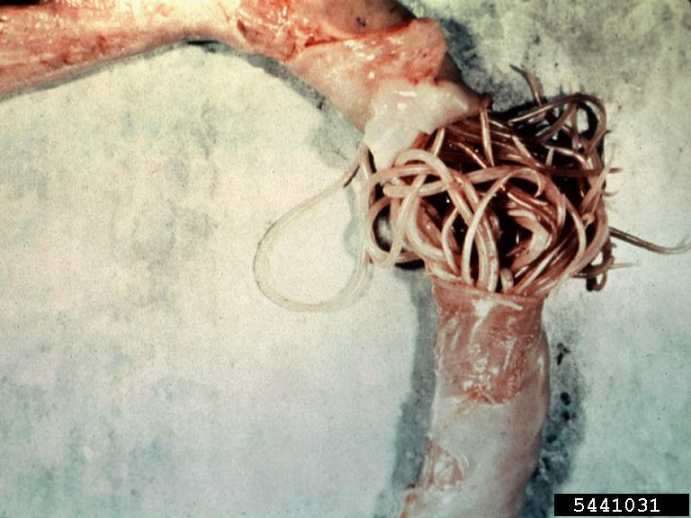

```{r setup, include=FALSE}
knitr::opts_chunk$set(echo = FALSE)

```




https://fineartamerica.com/shop/iphone+7plus+cases/ascaris+lumbricoides

https://doi.org/10.1371/journal.pone.0218867
## Vocabulary

| Ascariasis is non-endemic  |  regions does not exclude the possibility of ascariasis                                                                                                                                                                                                                                                                                                          |
| -------------------------- | ------------------------------------------------------------------------------------------------------------------------------------------------------- | 
| soil-transmitted helminthes     | intestinal worms infecting humans that are transmitted through the  soil contaminated                                                                                                                                                                                                      |
| allergic diseases   | conditions caused by hypersensitivity of the immune system to typically harmless substances                                                                                                                                                                                                           |
| ascaris infectious         |  presence of human parasite  in intestine due to  poor hygiene                                                                                                                                                                                                                                                              |
| Homeostatis                | process of organism to maintains or controls its internal despite external forces.                                                                                                                                                                                                                                                                                                                                                          |
| Sensitization to Ascaris   |process of the ascaris infectious triggers an immune reaction                                                                                                                                                                                                                                                                                                                                                                                  |
| anthroponotic disease      | the infectious disease  which causing agent carried by humans to animals                                                                                                                                                                                            |

## Analysis table


| Researchers?                 | National Cheng Kung University, TAIWAN (lead author: Lauren H. Jaege)                                                                                                                                                                                                                                                                                            |
| ---------------------------- | ------------------------------------------------------------------------------------------------------------------------------------------------------------------------------------------------------------------------------------------------------------------------------------------------------------------------------------------------------------------------------------------------------------------------------------------------------------------------------------------------------------------------------------------------------------------------------------------------------------------------------------------------------- |
| Published in?                | PLOS|ONE https://doi.org/10.1371/journal.pone.0218867 (24/06/2019)                                                                                                                                                                                      |
| General topic?               | The ascaris infections have been associated with significant disability and mortality, particularly in children.                                                                                                                                                                                                                                                                                                                                                   |
| Procedure/what was examined? |   Ascaris lumbricoides infections have been associated with a stronger regulation of the immune response that can be measured in vitro either at homeostatis.Ascaris are of specific interest to investigations on allergy-related diseases due to the immunological parallels between these two conditions. Both are associated with T helper 2 (Th2) cell induction, high levels of immunoglobulin E (IgE) and the involvement of immune cells such as mast cells, basophils and eosinophil.The researchers has emphasized also the importance of host genetics in determining host immune regulation, risk of atopy and susceptibility to helminths.                                                                                                                                                                                                                                                                                                           |
| Conclusions/discovery ?      | The impact of ascariasis on the inception and evolution of allergic diseases such as asthma is part of the long co- evolutionary history of helminths and humans and deserves more investigation. The sensitization to Ascaris  was a consistent risk factor for wheeze and asthma.the studies on immune mechanisms have illustrated how helminth infections can induce immune regulatory responses that may protect against allergic immune responses                                                                                                                                                                                                  |
| Remaining questions?         | Could this development of allergic sensitization to Ascaris lead to benign asthmatic disease ? Ascaridiosis could be develop yhe forms of resistance to anthelmintic drugs?                                                                                                                                                                                                                                                                                                                                                                                                                                                        |


