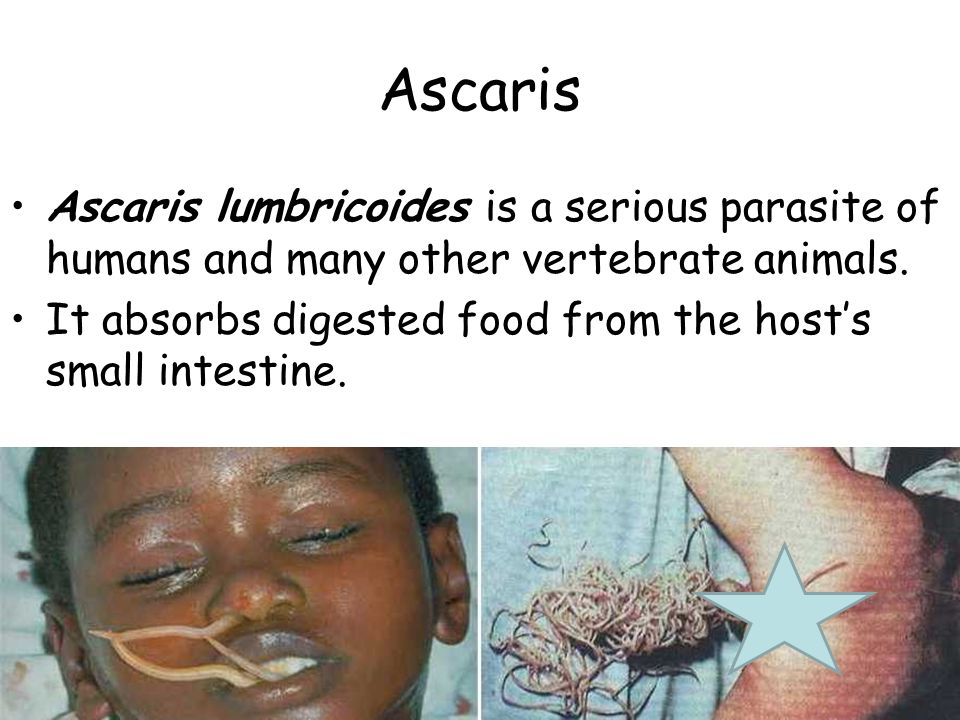

```{r setup, include=FALSE}
knitr::opts_chunk$set(echo = FALSE)
```

![(https://www.slideserve.com/vinnie/ascariasis-roundworm)]

## Vocabulary  
| Ascaris lumbricoides                 | Ascaris lumbricoides  it's an intestinal parasite of humans.                                                                                                       |
| ------------------------------------ | ------------------------------------------------------------------------------------------------------------------------------------------------------------------ |
| Acariasis                            | Acariasis human infected with Ascaris often show no symptoms, regardless of the species of worm.                                                                   |
| Immunoglobulin E (IgE)               | Immunoglobulin E (IgE) the allergenic activity of Ascaris IgE- binding molecular components and the immunological and clinical influences of ascariasis on asthma. |
| Asthma symptoms                      | Asthma symptoms the impact of ascariasis on the inception and evolution of allergic diseases .                                                                     |
| Ascaris lumbricoides is cosmopolitan | Ascaris lumbricoides is cosmopolitan Thus, ascariasis is a perfect example of an environmental disease.                                                            |

## Analysis table 

| Researchers                  | Obafemi Awolowo University, Ife-Ife Ile-Ife, Nigeria (lead author, Samuel Ore Asaolu ).Obafemi Awolowo University, Ife-Ife Ile-Ife, Nigeria (lead author, Ifeanyi Emmanuel Ofoezi).                                                                                                                                                                                                                                                                                                                                                                                                                                                                                                                                          |
| ---------------------------- | ---------------------------------------------------------------------------------------------------------------------------------------------------------------------------------------------------------------------------------------------------------------------------------------------------------------------------------------------------------------------------------------------------------------------------------------------------------------------------------------------------------------------------------------------------------------------------------------------------------------------------------------------------------------------------------------------------------------------------- |
| Published in?                |  http://www.waterpathogens.org/book/ascaris Michigan State University, E. Lansing, MI, UNESCO (April, 2019) .                                                                                                                                                                                                                                                                                                                                                                                                                                                                                                                                                                                                                |
| General topic                | The effects of Ascaris lumbricoides on allergy are likely to be determined by history of exposure over the life- course and by interactions with a wide variety of other infectious and non- infectious factors.                                                                                                                                                                                                                                                                                                                                                                                                                                                                                                             |
| Procedure/what was examined  | The pathological problems associated with Ascaris lumbricoides infection can be examined in four specific stages; larval migration; adults worms in the small intestine;  complications and  allergic reactions.The migrating larvae provoke inflammatory reactions in the intestinal mucosa, liver and lungs.  In the lungs, the larvae moving from the blood capillaries into the air spaces puncture the capillaries resulting in haemorrhage and oedema of the alveoli. This gives rise to cough, high fever, and bronchial asthma. This condition, regarded as Loeffler effect, results in transient lung infiltration with blood eosinophilia, and is frequently caused by Ascaris larvae migrating through the lungs.                                                                                                                                                                                 |
| Conclusions/discovery        | Transmission is through the faecal-oral route; eggs are ingested following contact with fecally or sludge contaminated food and/or soil, or the deliberate act of eating contaminated soil,scaris lumbricoides is cosmopolitan in distribution,  A.lumbricoides thrives in places where the soil is warm and humid, sanitation is poor and poverty and ignorance prevail. Ascariasis is prevalent in at least 150 of the 218 countries of the world.                                                                                                                                                                                                                                                                         |
| Remaining questions          | Could   Ascaris lumbricoides infection may be induce regulatory immune responses that can protect human to against allergic immune responses? health education could help to reduce exponentially the risk of Ascaris lumbricoides infestation ?.                                                                                                                                                                                                                                                                                                                                                                                                                                                                            |
