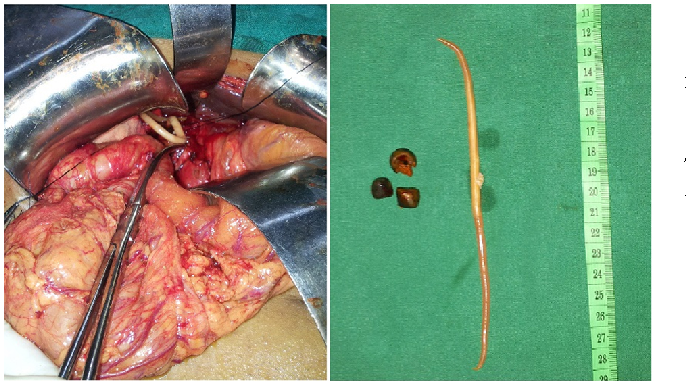

```{r setup, include=FALSE}
knitr::opts_chunk$set(echo = FALSE)
```


https://www.semanticscholar.org/paper/Recurrent-cholangitis-secondary-to-Ascaris-%E2%80%93-a-rare-Kumar-Nair/1879b948f330fdf351585609a469a93587f8b851

http://ijpa.tums.ac.ir 

## Vocabulary  
|Ascaris lumbricoides;                                           |nematode parasite in human intestine cause ascariasis                                                                                                                                                                                            |
| ------------------------------------------------------------------------------------------------------------------------------------------------- | ------------------------------------------------------------------------------------------------------------------------------------------------------------------ |
|Gallbladder                                                    |structure located under the liver, store and concentrate bile.                                                                                                                                                                                                        |
|High parasite burden                                           |maximum intensity of parasite causing illness or death                                                                                                                                                                                          |
|Under-developed countries                                      |coutries having widespread poverty and less economic developments                                                                                                                                                                                                                                                                                                                      |
|volvulus                                                       | the wist of intestine                                                                                                                                                                                                                                                                                                                                                                  |

## Analysis table 

|Researchers                  |Tarbiat Modares University, Khatam Al-Nabieen University,Tarbiat Modares University,Indira Gandhi Institute for Child Health: Kabul Afghanistan. (Lead autor: Abdolhossein DALIM)                                                                                                                                                                                                                                    |
| ---------------------------- | -------------------------------------------------------------------------------------------------------------------------------------------------------------------------------------------------------------------------------------------------------------------------------------------------------------------------------------------------------------------------------------------------------------------------------------------------------- |
|Published in?                                                 | Open access Journal at http://ijpa.tums.ac.ir                                                                                                                                                                                                                         |
|General topic                                                 | Gallbladder Perforation Due to Ascaris lumbricoides in a Pregnant Woman and 6 Year Old Girl.                                                                                                                                                                                                                                                                                                                                                                                                                                                                                                                                                                                                                                    |
|Procedure/what was examined                                   | In the ascariasis abdominal pain, anorexia, nausea, vomiting, fever, dehydration and abdominal distension are the most common symptoms of the disease. Moreover, intestinal obstruction may happen due to the high burden of parasite in children (6-8) years.The related manifestations are pneumonia and intestinal, appendicular, hepatobiliary and pancreatic ascariasis. In pregnancy, the risk of biliary ascariasis increases because of the high level of progesterone and estrogen hormones that influence Oddi sphincter, as previously proved in animal models; These hormones facilitate the migration of worms into biliary ducts.In case of jejunal obstruction with multiple masses, enterotomy and worm removal is the method of choice. Whenever the intestinal wall is thin, for instance, in volvulus cases, milking is avoided due to serosal tears and enterotomy would be better.                                                                                                                                                                                                                                                                                                                                                                                                                                                                                                                                                                                                                                                                                                                              |
|Conclusions/discovery                                       |  In case of bowel obstruction, dilated and airfilled intestinal loops are observed along with several air-fluid      levels, indicating the railway track sign.Today, the control of ascariasis is not as difficult as before, since the availability of anthelmintic drugs. The main key to eliminating ascariasis in the country is the elevation of sewage system and the other organizations related to disposal of human feces.                                                                                                                                                                                                                                                                                                                                                                                                                            |
|Remaining questions                                          | Could they have forms of resistance of the parasite Ascaris lumbricoides against treatment with antihelminthic drugs?.                                                                                                                                                                                                                                                                                                                                                                                                                                                                                                                                                                                 | 
