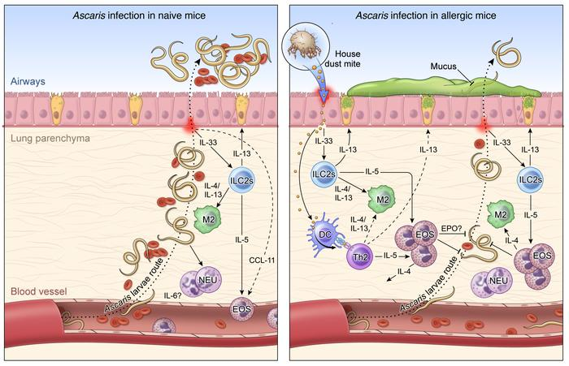

https://www.jci.org/articles/view/127963
## Vocabulary

|co-infecction                 |Association with Mycobacterium tuberculosis and Ascaris lumbricoides                                                                                                                               |
| -------------------------- | ------------------------------------------------------------------------------------------------------------------------------------------------------- |
|pulmonary tuberculosis       |Pulmonary lesions of tuberculosis                                                                                                                                                                                                                                                                                                 |
| Mycobacterium tuberculosis  | Obligate aerobe organism an that primarily infects the lungs                                                                                                                                                                                                                                                                                                |
|subpopulations               |CD4+ T and  CD8+ T cells activation the immune response against tuberculosis                                                                                                                                                                                                                                                                                                 |
|Cellular immunit                  | Immunological control of tuberculosis                                                                                                                                                                                                                                                                                             |
## Analysis table

|Researchers                      | Universidade do Estado do Amazonas, Universidade Federal de Goiás, Universidade Federal do Amazonas, Instituto de Pesquisas Leônidas & Maria Deane (Leaud author, Marcus Vinícius Guimarães Lacerda).                                                                                                                                                                                                                                                        |
| ---------------------------- | ------------------------------------------------------------------------------------------------------------------------------------------------------------------------------------------------------------------------------------------------------------------------------------------------------------------------------------------------------------------------------------------------------------------------------------------------------------------------------------------------------------------------------------------------------------------------------------------------------------------------------------------------------- |
|Published in?                     | Journal of the Brazilian Society of Tropical Medicine (6/11/2019).                                                                                                                                                                                                                                                                                                                                                                                          |
|General topic                    | Ascaris lumbricoides co-infection reduces tissue damage by decreasing IL-6 levels without altering clinical evolution of pulmonary tuberculosis.                                                                                                                                                                                                                                                                                                                                                                                                                                                                          |
|Procedure/what was examined      |Evaluation of the cellular immune response and the impact of the presence of Ascaris lumbricoides on the immune and clinical response in patients with pulmonary tuberculosis. The clinical course of pulmonary tuberculosis was studied after the diagnosis of Mycobacterium tuberculosis and Ascaris lumbricoides. In addition, immune cells and plasma cytokine profiles were examined.                                                                                                                                                                                                                                                                                                                                                                                                       |
|Conclusions/discovery            | Ascaris lumbricoides infection has an important clinical impact on the presentation and development of pulmonary tuberculosis. In addition, causes the reducing effects on the parenchymal lung lesions as well as on the bacillary load, and the use of interleukins 6 may be involved in this mechanism. The association with Ascaris lumbricoides has no effect on the proportions of T lymphocyte subpopulations. However, higher serum levels of Interleukins 6 in tuberculosis patients may explain the parenchymal lung lesions.                                                                                                                                                                                                                                                                                                                                                                                                                                                             |
|Remaining questions             |could it have an importance of the specific response to the antigen and of the regulatory cells in the pulmonary tissues in this case? could it be useful in the co-infection with Ascaris lumbricoides ?                                                                                                                                                                                                                                                                                                                                                                                                                                                              |
