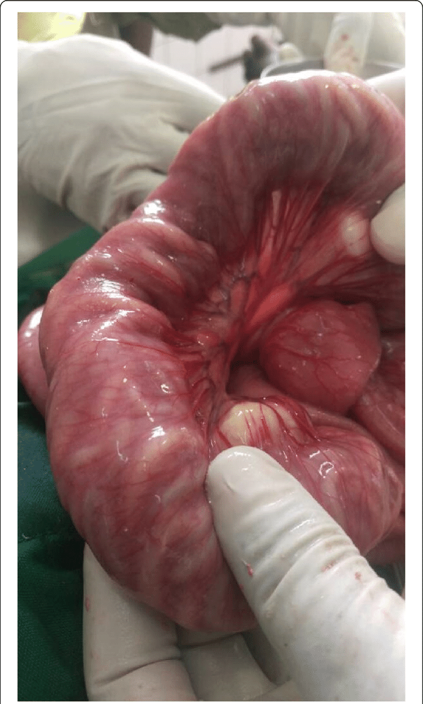

```{r setup, include=FALSE}
knitr::opts_chunk$set(echo = FALSE)
```


https://doi.org/10.1186/s13256-019-2103-y

## Vocabulary

| ascariais                           |   leading helminthic infection in worldwide                                                                                                                                                                                                                                                                                                                                                   |
| -------------------------- | ------------------------------------------------------------------------------------------------------------------------------------------------------- |
| asymptomati and symptomatic                 | absence of symptoms and specific symptom                                                                                                                |
| Intestinals obstructions                    |adhesions life-threatening of bowel                                                                                                                                                                           |
| abdominal distention                       |enlargement of an organ                                                                                                                                 |
## Analysis table
                                                                                                                                                            
| Researchers?                                   | Health Education and Research Organization (HERO) of Buea, Cameroon (lead author, Valirie Ndip Agbor).                                                                                                                                                                                                                                                                                                                                                                                          |
| ---------------------------- | ------------------------------------------------------------------------------------------------------------------------------------------------------------------------------------------------------------------------------------------------------------------------------------------------------------------------------------------------------------------------------------------------------------------------------------------------------------------------------------------------------------------------------------------------------------------------------------------------------------------------------------------------------- |
| Published in?                                   | Mbanga et al. Journal of Medical Case Reports (24 may 2019),   https://doi.org/10.1186/s13256-019-2103-y                                                                                                                                                                                                                                                                                                                     |
| General topic?                                  | Small bowel obstruction complicating an Ascaris lumbricoides infestation                                                                                                                                                                                                                                                                                                     |
| Procedure/what was examined?                    | A physical  examination  revealed signs of malnutrition, abdomen was distended and rectum was void of fecal material containts ascaris lumbricoides on rectal examination. The surgical approach revealed a dilated small bowel obstructed by bundles of live worms. milking of the worms through the stoma Postoperative management involved intravenously administered fluids with Ringer’s lactate,and intravenously administered paracetamol and full restoration of bowel.                                                                                                                                                                                                                                                                                                                                                                                                                                           |
| Conclusions/discovery ?                         | Ascariasis is a round intestinal worm infection transmit-ted by accidental ingestion of eggs present in human feces that contaminate food, soil, and water in areas of poor hygiene. However,  the high reinfection rate, efforts need to be channeled on improving  disease  control  at  local  levels  throughcommunity sensitization on STH, motivation of localactors, and proper education on the right environmen-tal hygiene practices..                                                                                                                                                                                                                                                                                                                                                                       |
| Remaining questions?                           | Could it's possible that the parasitic load could be the main cause of intestinal obstruction? Could it be that the side effects occur after the postoperative treatment?.                                                                                                                                                                                                                                                                                                                                                                                                                                                                                                                                     |
